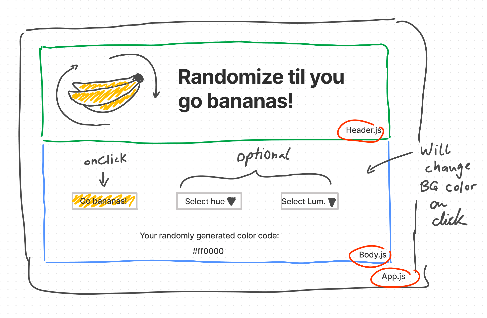

# React.js Random Color Generator

This React.js app is the first app being developed by Mathias Lukas as a bootcamp project. It's purpose is to show a hex code and change the color of it's body element in that hex code color.

# Stages of development

1. Designing the web app: sketching the design out on paper or in a tool like Figma.
2. Coming up with a list of React components that will be needed to build the app.
3. Describing how each component will interact with the other components.
4. Identify any unknown.
5. Build the app in React.js.

## Stage 1: Drafting process

Below sketch highlights the draft process of the application. It was sketched in Figma as a FigJam draft and describes the elements `Header.js`, `Body.js` and how they are imported into the main file `App.js`.

## Stage 2: React components used
