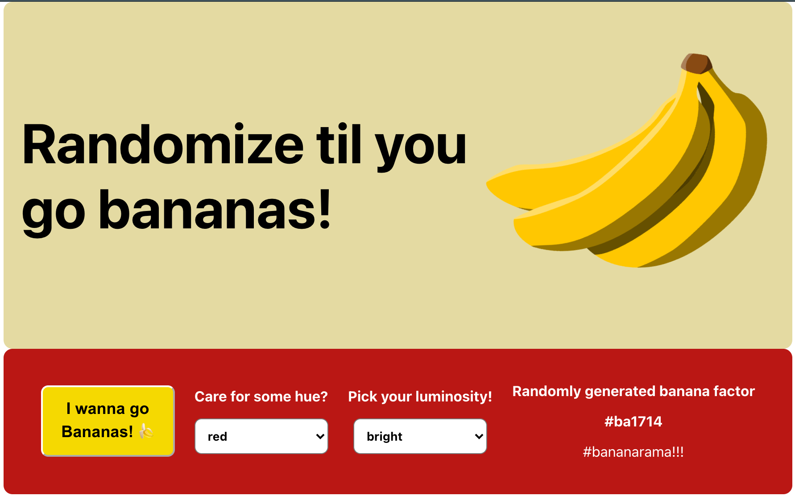
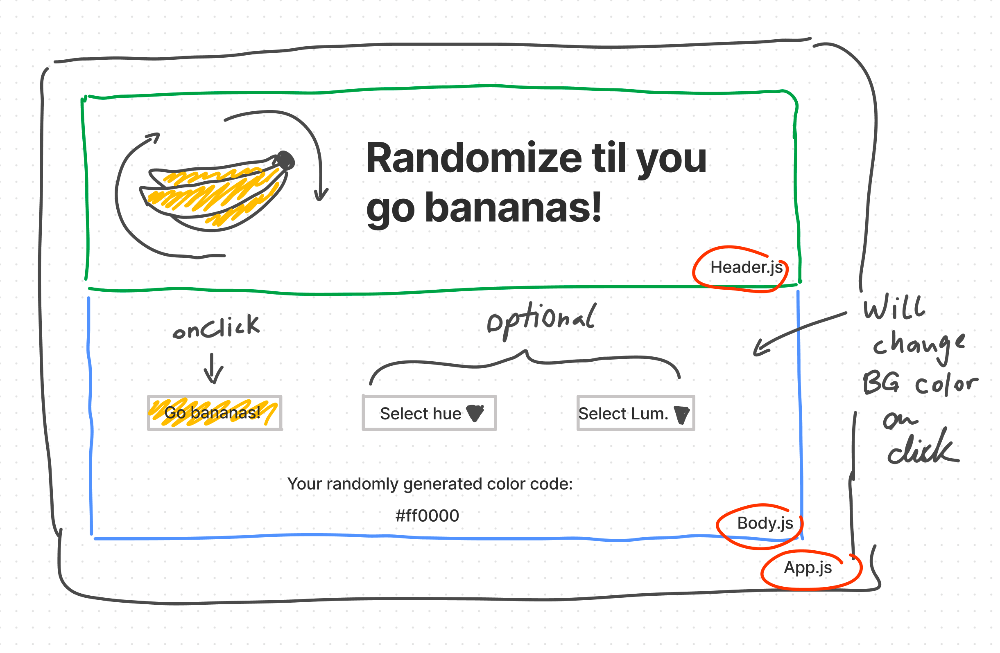

# React.js Random Color Generator

This React.js app is the first app being developed by Mathias Lukas as a bootcamp project. It's purpose is to show a hex code and change the color of it's body element in that hex code color.

### App Screenshot

# Stages of Development

1. Sketching the design out in Figma (FigJam).
2. Coming up with a list of React components that will be needed to build the app.
3. Describing how each component will interact with the other components.
4. Final deployment

## Stage 1: Drafting Process

Below sketch highlights the draft process of the application. It was sketched in Figma as a FigJam draft and describes the elements `Header.js`, `Body.js` and how they are imported into the main file `App.js`.

## Stage 2: React Components Used

A total of three components were created to build the app. `App` represents the container component holding the components `Header` and `Body`.

## Stage 3: Component Interaction

While the component `Header` only contains an animated image (relying on the CSS sheet `App.css`), and the headline, `Body` encompasses the entire random color generator and makes use of the external library `randomColor` to randomly generate the hex color codes at the right hand side of the body. The hex codes are generated on click by the user.

With the help of the `useState` hook, the hex code is passed to the library to define the background color upon the click.

In addition to randomly generating the hex code, the user can additionally define hue and luminosity, which in turn will influence the generated hex code.

`App.js` is the app file that builds the foundation of the entire app.

## 4. App Build & Deployment

The app was built within Visual Code Studio using React.js and CSS styling (`App.css`).

After finalization it was deployed at https://ml-react-color-generator.netlify.app/.
